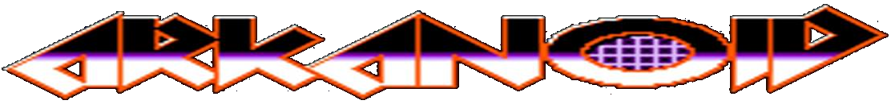

# 

## Оглавление
0. [Запуск](#Запуск)
1. [Управление](#Управление)
2. [Зачем?](#Зачем?)
3. [Внешний вид](#Внешний-вид)
4. [Особенности геймплея](#Особенности-геймплея)
5. [Особенности проекта](#Особенности-проекта)
6. [Видео работы приложения](#Видео-работы-приложения)

## Запуск
Перед запуском проекта установите необходимые зависимости 
```bash
  pip install -r requirements.txt
```
Проект разработан в Linux, но проверен и в Windows.
Версия Python 3.9 и выше (проверено и в 3.8).
Обязательно наличие звуковой карты на ПК для запуска.

## Управление
* Управление осуществляется курсорными клавишами ↑, ↓, ←, →. 
* Подтверждение выбора `Enter`. 
* Пауза во время игры `p`
* Выход из игры `ESC` или `q`


## Зачем?
Философский вопрос... Потому что требуется для защиты себя как преподавателя 2 года обучения, ну и потому что могу и умею.
____
[:arrow_up:Оглавление](#Оглавление)


## Внешний вид


____
[:arrow_up:Оглавление](#Оглавление)


## Особенности геймплея

* Надо написать о всем
  
* о бонусах 

* о генерации карт 
____
[:arrow_up:Оглавление](#Оглавление)


## Особенности проекта
* Проект написан на `pygame 2` с использованием языка `Python 3.9`
  
* Для меню используется библиотека `pygame-menu 4`, из-за проблем совместимости в Windows в старых версиях библиотек, работа мышки отключена в меню. 
____
[:arrow_up:Оглавление](#Оглавление)


## Видео работы приложения
TODO: Старое, надо перезалить
[](https://www.youtube.com/watch?v=8OsAKaevQtY)
____
[:arrow_up:Оглавление](#Оглавление)
