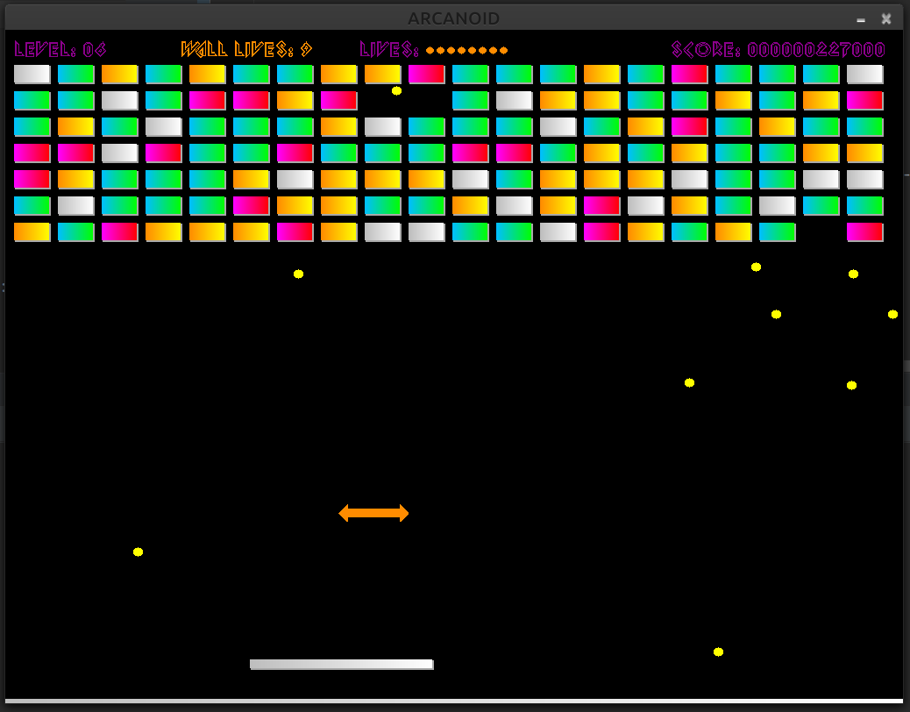

# 

## Оглавление
0. [Запуск](#Запуск)
1. [Управление](#Управление)
2. [Зачем?](#Зачем?)
3. [Внешний вид](#Внешний-вид)
4. [Особенности проекта и геймплея](#Особенности-проекта-и-геймплея)
5. [Видео работы приложения](#Видео-работы-приложения)

## Запуск
Перед запуском проекта установите необходимые зависимости 
```bash
  pip install -r requirements.txt
```
Проект разработан в Linux, но проверен и в Windows.
Версия Python 3.9 и выше (проверено и в 3.8).
Обязательно наличие звуковой карты на ПК для запуска.
!На macOS в одном случае не запустился! Причина не выяснена

## Управление
* Управление осуществляется курсорными клавишами ↑, ↓, ←, →. 
* Подтверждение выбора `Enter`. 
* Пауза во время игры `p`
* Выход из игры `ESC` или `q`

## Зачем?
Философский вопрос... Потому что требуется для защиты себя, как преподавателя 2 года обучения, ну и потому что могу и умею.
____
[:arrow_up:Оглавление](#Оглавление)


## Внешний вид
 
 

____
[:arrow_up:Оглавление](#Оглавление)


## Особенности проекта и геймплея

* Проект написан на `pygame2` с использованием языка `Python 3.9`
  
* Для меню используется библиотека `pygame-menu4`, из-за проблем совместимости в Windows в старых версиях библиотек, работа мышки отключена в меню.

* Для без проблемной отрисовки примитивов используются асинхронные вызовы рисования на игровом поле.
  
* Звуки взяты из оригинальной игры и перекодированы в .ogg для полной кроссплатформенной совместимости.
  
* Реализована регулировка громкости из меню.
  
* Для загрузки звуков используется хитрый прием, когда все из директории со звуками загружается в словарь, далее со словарем можно массов менять атрибуты звуков, например громкость.

* Все игровые объекты это примитивы, всего используется только 2 изображения для GameOver и логотипа в меню.

* Фактически в игре всего 3 объекта это мир где все происходит, мяч и кирпич. От кирпича с помощью наследования получены все остальные объекты:
    - для бонусов меняется отрисовка в зависимости от типа бонуса;
    - ракетка это тот же кирпич с другими размерами и с методом update;
    - нижняя стенка это тот же кирпич с другими размерами и кол-вом жизней.
    
* Уровни генерируются автоматически и чем выше уровень тем больше сложных кирпичей выпадает. От уровня зависит кол-во рядов, но их не может быть больше чем 12 шт.

* Теоретически кол-во уровней ничем не ограничено.

* В игре есть 4 типа кирпичей они отличаются цветом и кол-вом жизней (сколько раз мяч должен попасть по нему чтоб его уничтожить).

* При взаимодействии кирпича с мячом запускается эффект отрисовки взаимодействия. 
  
* Сгенерированный кирпич может быть со случайным бонусом. Есть или нет бонус в кирпиче ни как не видно. Бонус выпадет только после его уничтожения.

* Бонус выбирается случайно из набора бонусов. Для разных бонусов заданы разные вероятности появления.

* Всего в игре реализовано пока 6 видов бонусов:
  - 3 дополнительных мяча (кол-во мячей на поле будет не более 21 шт. за раз);
  - 3 дополнительные жизни (кол-во жизней не ограничено, но показано будет не более 20 шт)
  - Защитная стенка снизу которая выдерживает 10 попаданий мяча, если бонус будет взят повторно, к текущей стенке будет добавлено + 10 жизний. При уменьшении кол-ва жизней менее 5 цвет стенки будет менятся в так же как и у обычнх кирпичей. Если перешли на следующий уровень и была стенка то стенка переносится на сл уровень и жизни обнуляются на 10 (чтоб не было так просто);
  - Увеличение скорости всех мячей (максимальная скорость по любой координате не может быть выше определенной величины);
  - Уменьшение скорости всех мячей (минимальная скорость по любой координате не может быть меньше определенной величины);
  - Досрочный новый уровень;
  - Увеличение размера ракетки на некоторое время, но не более чем 2 раза всего;
  - Уменьшение размера ракетки на некоторое время, но не менее чем 1.7 раза всего.
  
* Первоначальный мяч имеет небольшой рандом для начальных скоростей по вертикали и горизонтали. Т.е. заранее не известно под каким углом он полетит при старте.

* Если ракетка двигается во время столкновения с мячом, и их направления совпадают, то скорости складываются или если нет, то вычитаются. Т.е. можно поменять угол отражения мяча во время игры.

* Есть режим сложности CHEATS который дает в первом уровне защитную стенку с 999 жизнями и выпадают сразу все виды бонусов.

* Игрок перед началом игры может задать свое имя, и это имя будет сохранено в таблице результатов.

* В таблице результатов сохраняется только игрок, который попал в 10 сильнейших.

* Игрок с режимом CHEATS в таблицу результатов не будет сохранен (справедливо).

____
[:arrow_up:Оглавление](#Оглавление)


## Видео работы приложения
[](https://www.youtube.com/watch?v=FamAeMrPDIY)
____
[:arrow_up:Оглавление](#Оглавление)
